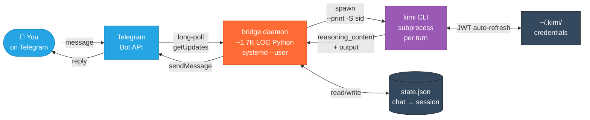
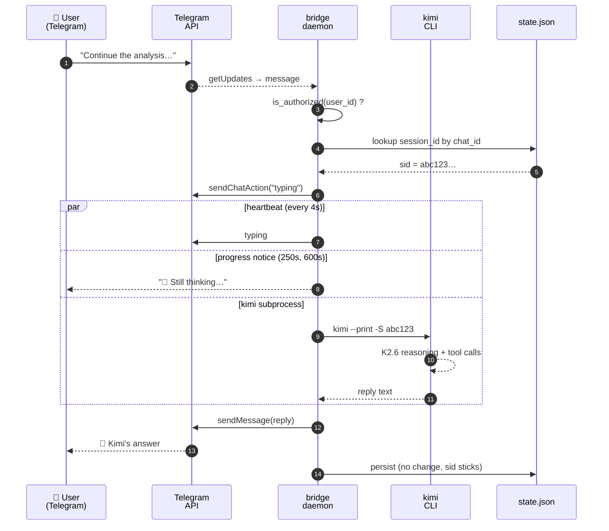
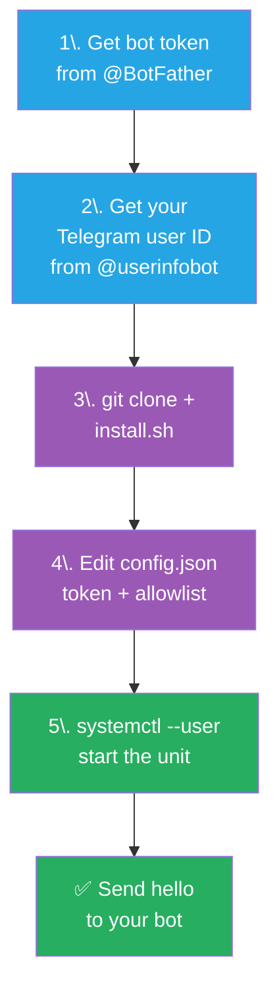
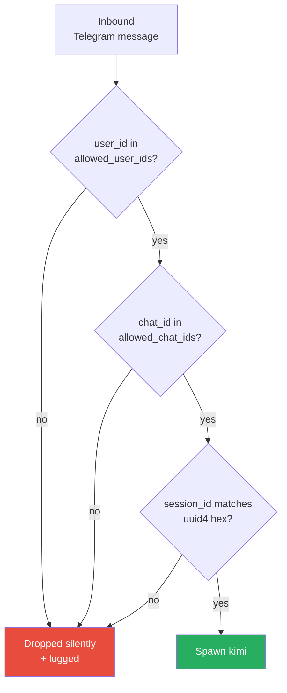
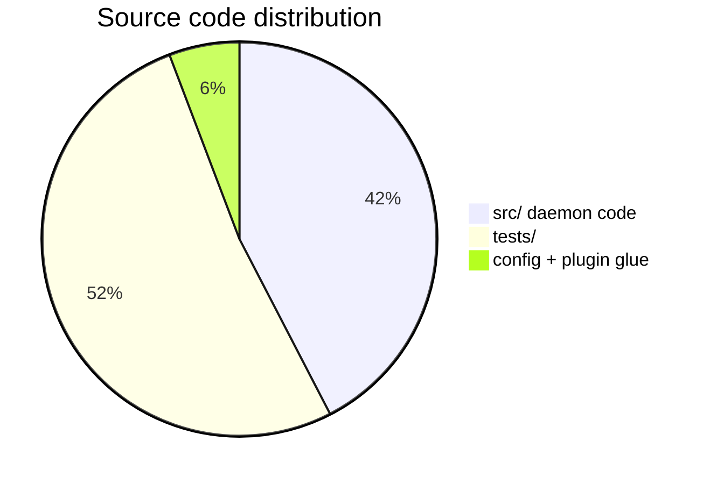

<div align="center">

# 📱 kimi-to-im

### Chat with [Kimi CLI](https://github.com/MoonshotAI/kimi-cli) from Telegram

**Self-hosted · single-user · ~1.7K LOC Python · systemd-supervised**

[](LICENSE)
[](https://www.python.org/downloads/)
[](https://www.freedesktop.org/wiki/Software/systemd/)
[](https://telegram.org/)
[](https://github.com/MoonshotAI/kimi-cli)

[](https://github.com/hah23255/kimi-to-im/actions/workflows/test.yml)
[](https://github.com/hah23255/kimi-to-im/stargazers)
[](https://github.com/hah23255/kimi-to-im/network/members)

</div>

---

## 💡 Why this exists

You already use Kimi CLI at your desk. This bridge lets you keep the **same conversation** going from your phone — over Telegram — without changing how Kimi runs locally. You send a message, the bridge spawns `kimi` on your machine, and the reply lands back in Telegram. Sessions persist per chat, so follow-ups pick up where you left off.

**Single-user, single-host, text-only by design.** No cloud component. No account system. The bot replies only to user IDs you explicitly whitelist.

---

## 🏗️ Architecture



---

## 🔁 Turn-by-turn flow



---

## ⚡ Quickstart (5 minutes)



You need: **Linux** with `systemd --user`, **Python 3.11+**, [`uv`](https://docs.astral.sh/uv/), and a working `kimi` CLI on your `PATH`. Full prerequisites and verification commands live in [`docs/deployment.md`](docs/deployment.md).

**1. Get a Telegram bot token.** Message [@BotFather](https://t.me/BotFather), send `/newbot`, follow the prompts. Copy the token.

**2. Get your Telegram user ID.** Message [@userinfobot](https://t.me/userinfobot). It replies with your numeric ID.

**3. Install.**

```sh
git clone https://github.com/hah23255/kimi-to-im.git ~/.kimi/plugins/telegram-bridge
cd ~/.kimi/plugins/telegram-bridge
bash install.sh
```

> Expected: a `.venv/` is created and a systemd user unit registered.

**4. Configure.**

```sh
cp config.example.json config.json
chmod 600 config.json
$EDITOR config.json   # paste bot_token, add your Telegram user ID to allowed_user_ids
```

**5. Start.**

```sh
systemctl --user start kimi-telegram-bridge.service
```

> Expected: `systemctl --user is-active kimi-telegram-bridge.service` prints `active`. Send "hello" to your bot from Telegram — within ~10s the typing indicator appears, then a Kimi reply.

For a more detailed walk-through with pre-flight checks and smoke tests, see [`docs/deployment.md`](docs/deployment.md).

---

## ⏱️ Timing & timeouts

```mermaid
gantt
    title Bridge timing budgets per Telegram turn
    dateFormat ss
    axisFormat %Ss

    section Typing indicator
    Refresh every 4s         :active, 0, 4s
    Refresh                  :active, 4, 4s
    Refresh                  :active, 8, 4s

    section Progress notices
    "Still thinking…" @ 250s :crit, 250, 5s
    "Still thinking…" @ 600s :crit, 600, 5s

    section Kimi subprocess
    Allowed work window      :active, 0, 900s
    Hard kill                :crit, 900, 5s

    section JWT
    OAuth token (15min TTL)  :active, 0, 900s
    Auto-refresh             :crit, 600, 1s
```



| Event | Time |
|---|---|
| Typing indicator refresh | every 4 s |
| First progress notice | 250 s (~4 min) |
| Second progress notice | 600 s (~10 min) |
| Kimi subprocess hard timeout | **900 s** (15 min, aligned with JWT TTL) |
| OAuth JWT auto-refresh cadence | every 10 min (TTL is 15 min) |

> The 15-minute ceiling is intentional — Kimi K2.6 with thinking on a 160 K-token context routinely needs 5–12 minutes per complex turn. We bound long enough for real work, short enough that truly hung subprocesses get cleaned up.

---

## 🛡️ Defence-in-depth



The systemd unit ships hardened by default:

| Layer | Mechanism |
|---|---|
| **Identity** | Default-deny allowlist on `allowed_user_ids` + `allowed_chat_ids` |
| **Subprocess argv** | `session_id` validated against uuid4-hex regex before being passed to `kimi` |
| **Network** | `RestrictAddressFamilies=AF_UNIX AF_INET AF_INET6` |
| **Filesystem** | `PrivateTmp`, `UMask=0077`, config 0600 |
| **Kernel surface** | `ProtectKernelTunables`, `ProtectKernelModules`, `LockPersonality` |
| **Syscalls** | `SystemCallFilter=@system-service ~@privileged ~@resources` |
| **Logs** | `httpx` INFO suppressed so bot token never lands in `bridge.log` |
| **Liveness** | `Restart=on-failure`, exit-124 timeout safety net |

Full security policy: [`SECURITY.md`](SECURITY.md). Audit findings: [`docs/security-scan.md`](docs/security-scan.md).

---

## 📊 Repo at a glance

| | |
|---|---|
| **Language** | Python 3.11+ |
| **Source LOC** | 1,698 |
| **Test files** | 10 (full suite < 2 s) |
| **External runtime deps** | 1 (`httpx`) |
| **External system deps** | `kimi` CLI on `PATH`, systemd-user |
| **Lines per turn (avg request path)** | ~50 |
| **First-launch RAM** | ~22 MB (idle) |
| **Steady-state RAM** | ~80–200 MB depending on Telegram polling state |



---

## 🧰 What it does and doesn't

This is intentionally a small, opinionated tool.

**It does:**

- ✅ Bridge Telegram ↔ Kimi CLI as separate subprocesses per turn
- ✅ Persist session continuity per chat
- ✅ Run as a `systemctl --user` service with hardening
- ✅ Refresh the OAuth JWT automatically (10-min cadence, 15-min TTL)
- ✅ Stream typing indicator + progress notices for long turns
- ✅ Surface friendly error messages (no raw stderr leaks)
- ✅ Validate inputs against a default-deny allowlist

**It does NOT:**

- ❌ Support Discord, Slack, Feishu, QQ, or any IM other than Telegram
- ❌ Handle images, voice, or file uploads (text only)
- ❌ Stream replies token-by-token (Kimi emits per-turn JSON, bridge sends per-turn)
- ❌ Expose Kimi's internal tool calls or ask for permission before they run
- ❌ Sync state between machines (one bridge per host)
- ❌ Multi-user (architecturally single-user — by design, not laziness)

If you need any of these, this bridge is the wrong tool.

---

## ⚙️ Configuration

The full reference lives in [`docs/operations.md`](docs/operations.md#configure-the-bridge). The minimum to know:

| Field | Required | Purpose |
|---|---|---|
| `telegram.bot_token` | yes | The string from BotFather. |
| `telegram.allowed_user_ids` | yes | Whitelist of Telegram user IDs. Empty = nobody can talk to the bot (default-deny). |
| `telegram.allowed_chat_ids` | recommended | Optional chat-level whitelist. Set to your DM's chat id (= your user id) so the bot won't respond inside groups. |
| `kimi.default_workdir` | no | Where Kimi runs. Defaults to Kimi's own default. |
| `kimi.model` | no | Empty = Kimi's default model. |

`config.json` is gitignored. Don't commit your token.

---

## 📚 Documentation

| Document | Read this when... |
|---|---|
| [`docs/deployment.md`](docs/deployment.md) | You're installing for the first time. |
| [`docs/operations.md`](docs/operations.md) | You're running the bridge day-to-day, or troubleshooting. |
| [`docs/design.md`](docs/design.md) | You want to understand why the architecture looks the way it does. |
| [`docs/security-scan.md`](docs/security-scan.md) | You want the formal pre-publication audit findings. |
| [`SECURITY.md`](SECURITY.md) | You found a vulnerability or want the security policy. |
| [`CONTRIBUTING.md`](CONTRIBUTING.md) | You want to send a patch. |

---

## 🤝 Contributing

PRs welcome. Please read [`CONTRIBUTING.md`](CONTRIBUTING.md) and run the tests:

```sh
uv venv .venv --python 3.11
uv pip install -e ".[dev]"
.venv/bin/pytest -v
```

The full suite runs in **under 2 seconds** and is the gate for CI.

---

## 📜 License

MIT — see [LICENSE](LICENSE).

---

<div align="center">

**Built for one user, one host, one Telegram chat.**
**Not trying to be more than that.**

[Report an issue](https://github.com/hah23255/kimi-to-im/issues) · [Security policy](SECURITY.md) · [Discussions](https://github.com/hah23255/kimi-to-im/discussions)

</div>
